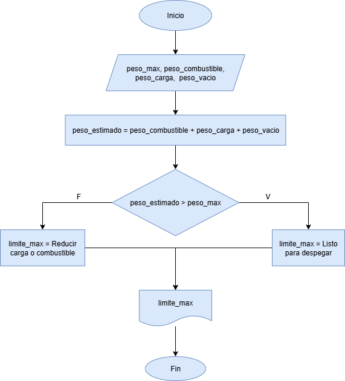
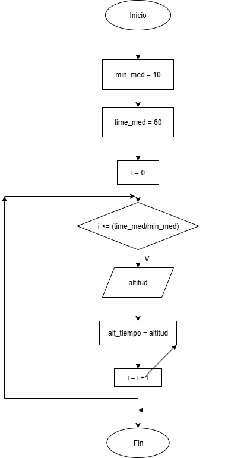
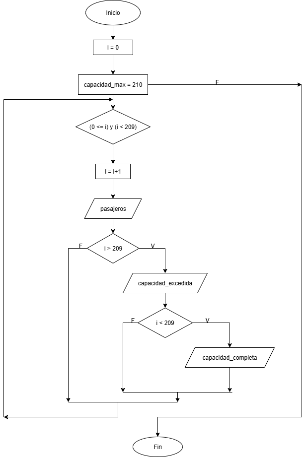

## Taller Unidad 2

### Ejercicio con condicionales

 Verificación de peso de despegue
    
    En una pista de pruebas de aeronaves, el sistema debe verificar si el peso total de la aeronave, incluyendo combustible y carga, supera el límite máximo permitido para el despegue. Dependiendo del resultado, el sistema deberá indicar si la aeronave está lista para despegar o si debe reducir carga o combustible. 

## Análisis

| Variable entrada | Descripción |
|------------------|-------------|
| peso_max | Peso máximo de la aeronave a analizar |
| peso_combustible | Peso del combustible estimado |
| peso_carga | Peso de la carga estimada (pasajeros, equipaje) |
| peso_vacio | Peso de la aeronave vacía |

| Variable intermedia | Descripción |
|---------------------|-------------|
| peso_estimado | La suma del peso del combustible, de la carga y del peso vacío |

| Variable salida | Descripción |
|-----------------|-------------|
| limite_max | Indica si se sobrepasa el peso máximo o no |

## Diagrama de flujo

### Ejercicio con bucles

Registro de altitudes de vuelo
    
    Un sistema debe registrar la altitud de vuelo cada 10 minutos durante una hora y mostrar todas las mediciones al final.

## Análisis

| Variable entrada | Descripción |
|------------------|-------------|
| altitud | Altitud registrada |

| Variable control | Descripción |
|------------------|-------------|
| i |

| Constante | Descripción |
|-----------|-------------|
| time_med | Tiempo medición de 1 hora |
| min_med | Cada 10 minutos registro de altitud |

| Variable salida | Descripción |
|-----------------|-------------|
| alt_tiempo | Altitudes en el tiempo |

## Diagrama de flujo

### Ejercicio con bucle y condicional

Simulación de conteo de pasajeros
    
    Durante el abordaje, un sistema cuenta a los pasajeros que ingresan. Si el número total supera la capacidad máxima, el sistema debe detener el conteo y mostrar un mensaje de alerta.

## Análisis

| Variable entrada | Descripción |
|------------------|-------------|
|ingreso_pax       | Pasajeros que ingresan a la aeronave |

|Variable Intermedia | Descripción |
|--------------------|-------------|
| Pasajeros | Cada pasajero |

| Variable control | Descripción |
|------------------|-------------|
| i |

| Variable salida | Descripción |
|-----------------|-------------|
| capacidad_max   | Capacidad máxima de pasajeros en la aeronave |

## Diagrama de flujo

