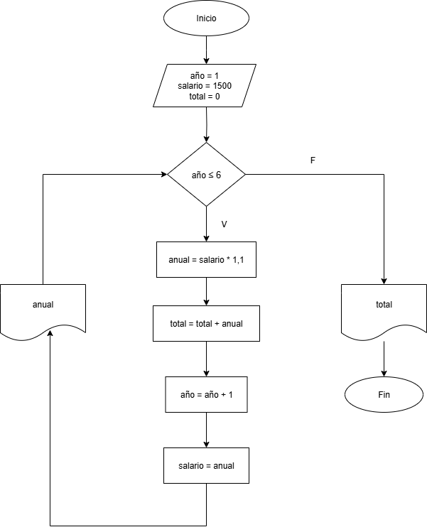
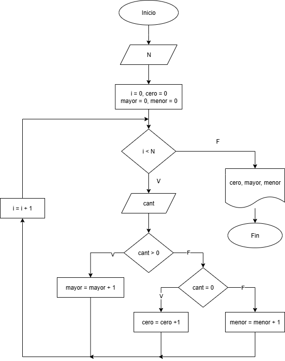

## Ejercicio 1

Un profesor tiene un salario inicial de $1500, y recibe un incremento de 10% anual durante 6 años. ¿Cuál es su salario al cabo de 6 años? ¿Qué salario ha recibido en cada uno de los 6 años? Realice el algoritmo y represente la solución mediante el diagrama de flujo, el pseudocódigo y el diagráma N/S, utilizando el ciclo apropiado.

### Análisis

| Input |
|-------|
| salario = (salario * 0,1) + salario |

| Output |
|--------|
| anual, total |

| Control |
|---------|
| año |

### Pseudocódigo
```
Inicio
año = 1
salario = 1500
total = 0
mientras año <= 6:
    anual = salario * 1,1
    total = total + anual
    salario = anual
    año = año + 1
    Mostrar anual
Fin mientras
Mostrar total
Fin
```
## Diágrama de flujo


## Ejercicio 2

Se requiere un algoritmo para determinar, de N cantidades, cuántas son cero, cuántas son menores a cero y cuántas son mayores a cero. Realice el diagrama de flujo y el pséudocódigo.

### Análisis

| Input |
|-------|
| N, cant |

| Output |
|--------|
| cero, mayor, menor |

| Control |
|---------|
| i |

### Pseudocódigo
```
Inicio

leer N

ceros <= 0
menores <= 0
mayores <= 0

i < 1 hasta N hacer
  leer numero
Si numero = 0 entonces ceros < ceros + 1

Sino
  Si numero < 0 entonces menores = menores + 1
Sino 
  mayores = mayores + 1

Fin mientras
Mostrar ceros, menores, mayores
Fin
```

## Diagráma de flujo




