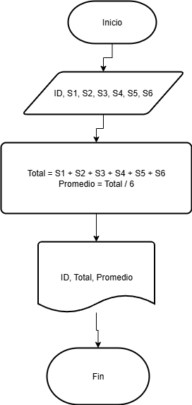
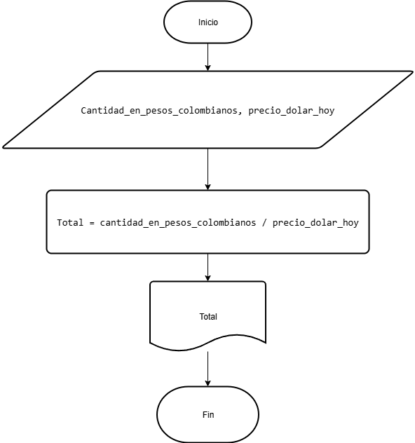

# Ejercicios

Total semestre y el promedio mensual, e imprima el ID del empleado

##  Pseudocódigo

```
Inicio
Leer ID, S1, S2, S3, S4, S5, S6
Total = S1 + S2 + S3 + S4 + S5 + S6
Promedio = Total / 6
Mostrar ID, Total, Promedio
Fin
```

## Diagrama de flujo


## Ejercicio 3
Una empresa importadora desea determinar cuántos dólares puede adquirir con equis cantidad de dinero colombiano. Realice un diagrama de flujo y pseudocódigo que representen el algoritmo para tal fin.

```
Inicio
Leer cantidad_en_pesos_colombianos, precio_dolar_hoy
Total = cantidad_en_pesos_colombianos / precio_dolar_hoy
Mostrar Total
Fin
```



