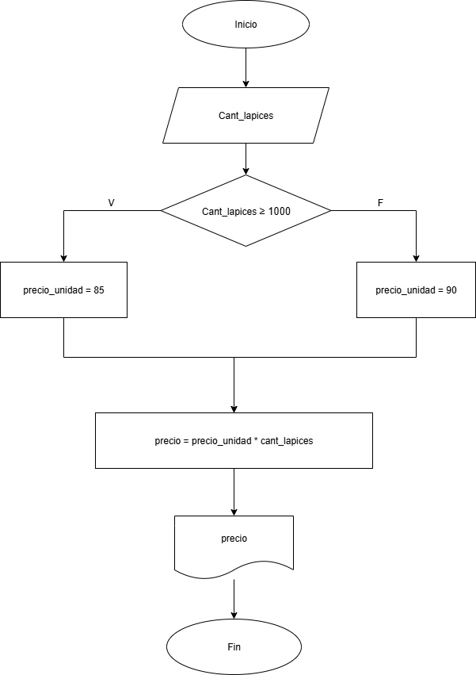
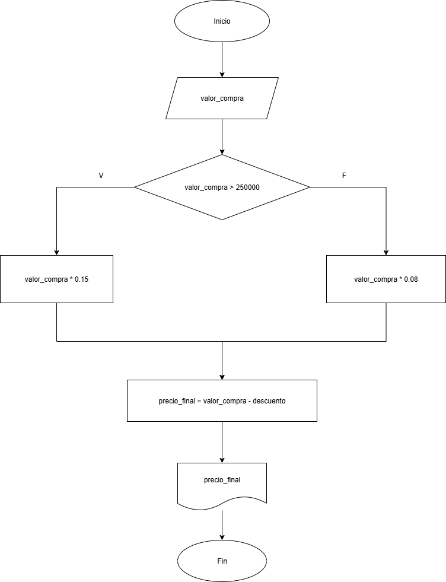
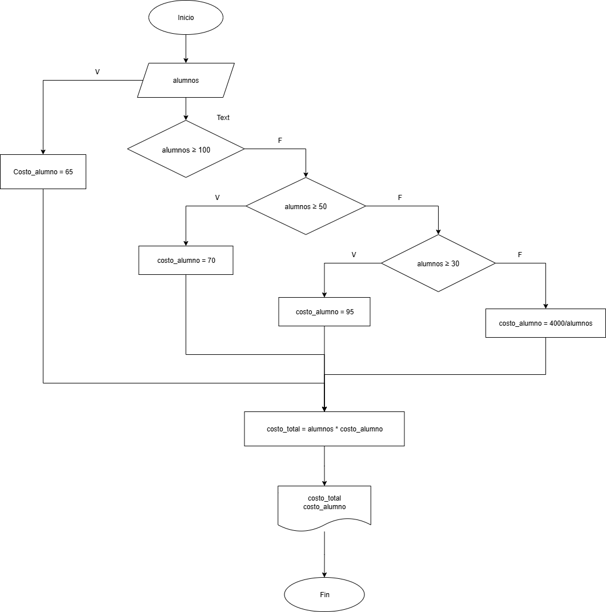
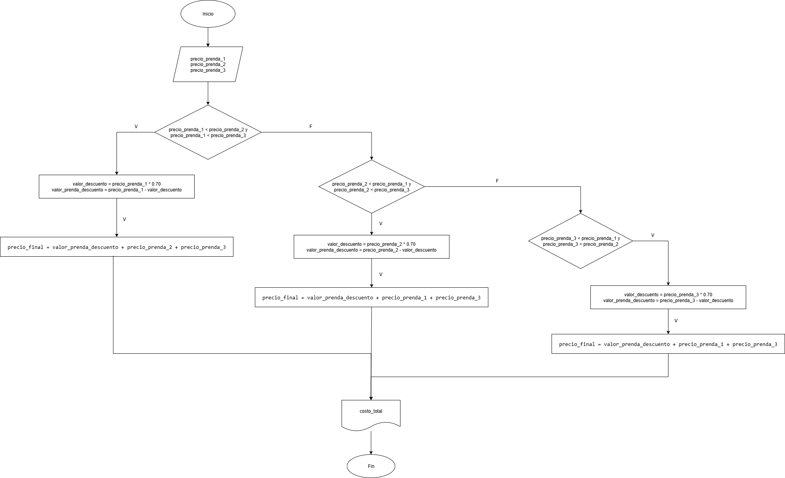

## Ejercicio 3

Realice un algorítmo para determinar cuánto se debe pagar por equis cantidad de lápices considerando que si son 1000 o más el costo es de $85 cada uno; de lo contrario, el precio es de $90. Represéntelo con el pseudocódigo y el diagrama de flujo.

### Análisis

| Variable de entrada | Descripción |
|---------------------|-------------|
| cant_lapices | Cuántos lápices se compran|

| Variables de salida | Descripción |
|---------------------|-------------|
| precio | Valor que hay que pagar |

| Variables intermedias | Descripción |
|-----------------------|------------|
| valor_unitario | Usada dentro del código |

| Constantes | Descripción |
|------------|-------------|
| 1000 | Cantidad límite de lápices |
| $85, $90 | Valor individual según la cantidad |

## Pseudocódigo

```
Inicio
Leer cant_lapices
Si cant_lapices >= 1000
   valor_unidad = 85
Si no
   valor_unidad = 90
Fin Si
precio = valor_unidad * cant_lapices
Escribir "Valor total: ", precio
Fin
```

## Diagrama de flujo


## Ejercicio 4

Un almacén de ropa tiene una promoción: por compras superiores a $250000 se les aplicará un descuento de 15%, de caso contrario, solo se aplicará un 8% de descuento. Realice un algorítmo para determinar el precio final que debe pagar una persona por comprar en dicho almacén y de cuánto es el descuento que obtendrá. Represéntelo mediante el pseudocódigo y el diagrama de flujo.

### Análisis

| Variable de entrada | Descripción |
|---------------------|-------------|
| valor_compra | Costo parcial de las prendas |

| Variables de salida | Descripción |
|---------------------|-------------|
| precio_final | Valor que hay que pagar |
|descuento     | Valor del descuento |

| Constantes | Descripción |
|------------|-------------|
| 250000 | valor a partir del cual se da el descuento |
| 15%, 8% | descuentos |

## Pseudocódigo

```
Inicio
Leer valor_compra
Si valor_compra > 250000
   descuento = valor_compra * 0.15
Si no
   descuento = valor_compra * 0.08
Fin Si
precio_final = valor_compra - descuento
Mostrar "valor a pagar: $", precio_final
Fin
```

## Diagráma de flujo


## Ejercicio 5

El director de una escuela está organizando un viaje de estudios, y requiere determinar cuánto debe cobrar a cada alumno y cuánto debe pagar a la compañía de viajes por el servicio. La forma de cobrar es la siguiente: si son 100 alumnos o más, el costo por cada alumno es de $65.00; de 50 a 99 alumnos, el costo es de $70.00, de 30 a 49, de $95.00, y si son menos de 30, el costo de la renta del autobús es de $4000.00, sin importar el número de alumnos.

### Análisis

| Variable de entrada | Descripción |
|---------------------|-------------|
| costo_alumno | Costo por cada alumno|

| Variables de salida | Descripción |
|---------------------|-------------|
| costo_total | Costo total de cantidad de alumnos que irán |

| Constantes | Descripción |
|------------|-------------|
| $4000.00 | Costo autobús sin importar el número de alumnos |
| $65.00 | Costo por cada alumno si van 100 alumnos o más |
| $70.00 | Costo por cada alumno si van 30 a 49 alumnos |
| $95.00 | Costo por cada alumno si van menos de 30 alumnos | |

### Pseudocódigo

```
Inicio
Leer alumnos
Si alumnos >= 100
   costo_alumno = 65
Si no
   Si alumnos >= 50
      costo_alumno = 70
Si no
   Si alumnos >= 30
      costo_alumno = 95
Fin Si
costo_total = alumnos * costo_alumno
Mostrar "valor a pagar: $", costo_total, costo_alumno
Fin
``` 

## Diagrama de flujo


## Ejercicio 6

Una tienda de ropa tiene la siguiente promoción: por la compra de tres productos, la prenda de menor valor, tiene un 70% de descuento.
Calcular cuál fue el descuento aplicado y cuánto tiene que pagar la persona.

## Análisis

| Variable de entrada | Descripción |
|---------------------|-------------|
| precio_prenda_1 | Costo de cada prenda |
| precio_prenda_2 | Costo de cada prenda |
| precio_prenda_3 | Costo de cada prenda |

| Variables intermedias | Descripción |
|-----------------------|------------|
| valor_descuento | Precio de la prenda por el descuento
| valor_prenda_descuento | Precio de la prenda aplicado el descuento

| Variables de salida | Descripción |
|---------------------|-------------|
| precio_final | Valor que hay que pagar |
| valor_descuento     | Valor del descuento |

| Constantes | Descripción |
|------------|-------------|
| 3 | valor a partir del cual se da el descuento |
| 70% | descuentos |

### Pseudocódigo

```
Inicio
Leer precio_prenda_1
     precio_prenda_2
     precio_prenda_3
Si precio_prenda_1 < precio_prenda_2 y precio_prenda_1 < precio_prenda_3
   valor_descuento = precio_prenda_1 * 0.70
   valor_prenda_descuento = precio_prenda_1 - valor_descuento
   precio_final = valor_prenda_descuento + precio_prenda_2 + precio_prenda_3
Si no
   Si precio_prenda_2 < precio_prenda_3 y precio_prenda_2 < precio_prenda_1
     valor_descuento = precio_prenda_2 * 0.70
     valor_prenda_descuento = precio_prenda_2 - valor_descuento
     precio_final = valor_prenda_descuento + precio_prenda_1 + precio_prenda_3
Si no
   Si precio_prenda_3 < precio_prenda_1 y precio_prenda_3 < precio_prenda_2
     valor_descuento = precio_prenda_3 * 0.70
   valor_prenda_descuento = precio_prenda_3 - valor_descuento
   precio_final = valor_prenda_descuento + precio_prenda_1 + precio_prenda_2
Fin si
Mostrar "valor a pagar: $", costo_total
Fin
```

## Diagrama de flujo


## Homework
A cada persona se le tomarán los datos en que nacieron: día, mes y año. Con el día-actual, mes-actual y año actual, hallar cuántos años tienen.

## Análisis


### Pseudocódigo


## Diagrama de flujo


